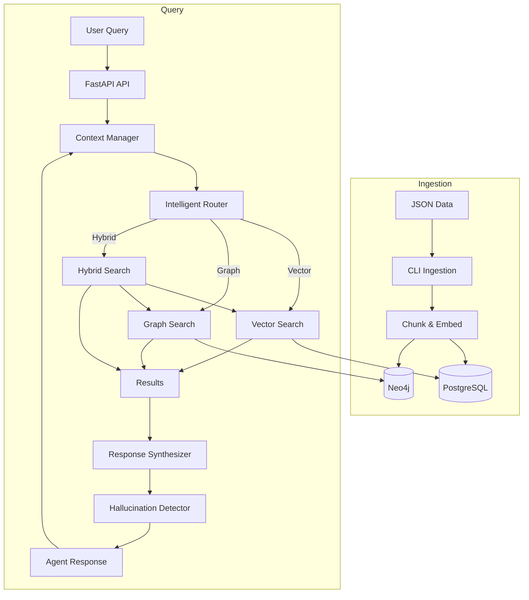

# TrackRealties AI

TrackRealties AI is a RAG (Retrieval-Augmented Generation) application for real estate analysis. It provides a suite of tools for different real estate roles, including investors, developers, buyers, and agents.

## How it Works

The application is built around a set of specialized AI agents, each tailored to a specific real estate role. These agents use a combination of a RAG pipeline and a set of tools to answer user queries. The RAG pipeline provides the agents with relevant information from a knowledge base, and the tools allow the agents to perform specific actions, such as searching for properties or analyzing market data.

The application is built with FastAPI with Pydantic AI and uses a PostgreSQL database to store session and conversation data, and a Neo4j database to store the knowledge graph.

### System Flow


## Getting Started

### Prerequisites

*   Python 3.11+
*   Use `pip` to install dependencies on Windows
*   PostgreSQL database (Neon DB is recommended)
*   Neo4j database

### Installation

1.  **Clone the repository:**
    ```bash
    git clone https://github.com/your-username/trackrealties-ai.git
    cd trackrealties-ai
    ```

2.  **Install dependencies:**
    ```bash
    py -m pip install -r requirements.txt
    ```

3.  **Set up the databases:**
    *   **PostgreSQL (Neon DB):**
        *   Sign up for a free Neon DB account and create a new project.
        *   Copy the `.env.example` file to `.env` and update the `DATABASE_URL` with your Neon DB connection string.
    *   **Neo4j:**
        *   Sign up for a free Neo4j Aura account and create a new database.
        *   Update the `.env` file with your Neo4j credentials (`NEO4J_URI`, `NEO4J_USER`, `NEO4J_PASSWORD`).

4.  **Set up the database schema:**
    *   Copy the contents of the `sql/new_schema.sql` file and run it in your Neon DB SQL editor. This will create the necessary tables.

### Data Ingestion

The ingestion layer is responsible for populating the PostgreSQL and Neo4j databases with data.

1.  **Clear existing data (optional):**
    *   If you want to start with a clean slate, you can run the following command to clear all data from the database tables.
    *   **Warning:** This will permanently delete all data in the tables.
    ```bash
    python check_and_clear_data.py
    ```

2.  **Ingest data:**
    *   The application provides a CLI for ingesting data from JSON files.
    *   **Ingest property listings:**
        ```bash
        python -m src.trackrealties.cli enhanced-ingest sample_property_listings.json --data-type property
        ```
    *   **Ingest market data:**
        ```bash
        python -m src.trackrealties.cli enhanced-ingest sample_market_data.json --data-type market
        ```
    *   This will chunk the data, generate embeddings using OpenAI's `text-embedding-3-small` model, and store the data in the PostgreSQL and Neo4j databases.

### Training Role-Specific Models

The repository includes scripts for creating training datasets and fine-tuning small language models for each user role.

1. **Prepare the training data**
    ```bash
    python scripts/prepare_training_data.py
    ```
    This generates JSONL files under `training_data/` for investor, developer, buyer and agent roles.

2. **Fine-tune the models**
    ```bash
    python scripts/fine_tune_models.py
    ```
    Each model will be saved under `models/{role}_llm/`.

The application loads these models automatically when creating agents.
### Key Features

* **Intelligent Query Router** – Extracts entities, classifies intent and routes queries to vector, graph or hybrid search strategies. Diagnostics are available from `POST /rag/query-router`.
* **Conversation Context** – The `ContextManager` saves each message and provides CRUD helpers. Stored context can be viewed or cleared via `/conversations/context/{session_id}`.
* **Role-Specific Models and Prompts** – Agents automatically load their fine-tuned models and use shared prompt templates.
* **Hallucination Detection** – `RealEstateHallucinationDetector` validates responses and flags unrealistic figures.
* **Search Analytics** – `SearchAnalytics` records strategy usage and response times. Metrics are available from `GET /analytics/search-report`.
* **End-to-End Tests** – `scripts/e2e_test_suite.py` ingests sample data, calls the API and confirms messages are logged correctly.


### Running the Application

To run the application, use the following command:

```bash
py -m uvicorn src.trackrealties.api.main:app --reload
```

The API will be available at `http://localhost:8000`.

## API Endpoints

The API is documented with Swagger UI, which is available at `http://localhost:8000/docs`.

### Health

*   **`GET /health`**: Health check endpoint.

### Session

*   **`POST /session/`**: Creates a new user session.
    *   **Request Body:**
        *   `role` (string): The role of the user (e.g., "investor", "developer", "buyer", "agent").
        *   `user_id` (string, optional): The ID of the user.
    *   **Response:**
        *   `session_id` (string): The ID of the new session.
        *   `role` (string): The role of the user.
        *   `created_at` (string): The timestamp when the session was created.

*   **`GET /session/{session_id}`**: Gets session details.

### Chat

*   **`POST /chat/`**: Handles a non-streaming chat message.
    *   **Request Body:**
        *   `session_id` (string): The ID of the session.
        *   `message` (string): The user's message.
    *   **Response:**
        *   `message` (string): The assistant's response.
        *   `session_id` (string): The ID of the session.
        *   `assistant_message_id` (string): The ID of the assistant's message.
        *   `tools_used` (array): A list of tools used by the assistant.

*   **`POST /chat/stream`**: Handles a streaming chat message.

### Agents

*   **`POST /agents/{role}/chat`**: Handles a chat message for a specific agent role.
    *   **URL Parameters:**
        *   `role` (string): The role of the agent (e.g., "investor", "developer", "buyer", "agent").
    *   **Request Body:**
        *   `session_id` (string): The ID of the session.
        *   `message` (string): The user's message.
    *   **Response:**
        *   `message` (string): The assistant's response.
        *   `session_id` (string): The ID of the session.
        *   `assistant_message_id` (string): The ID of the assistant's message.
        *   `tools_used` (array): A list of tools used by the assistant.

### Analytics

*   **`GET /analytics/cma/{property_id}`**: Generate a Comparative Market Analysis (CMA) for a given property.

### Conversation

*   **`POST /conversations/messages`**: Create a new conversation message.
*   **`GET /conversations/messages/{message_id}`**: Get a message by ID.
*   **`PATCH /conversations/messages/{message_id}`**: Update an existing message.
*   **`DELETE /conversations/messages/{message_id}`**: Delete a message.
*   **`GET /conversations/sessions/{target_session_id}`**: Get conversation history for a session.
*   **`GET /conversations/summaries`**: Get conversation summaries based on filter criteria.
*   **`DELETE /conversations/sessions/{target_session_id}`**: Delete an entire conversation.
*   **`GET /conversations/context/{session_id}`**: Retrieve stored conversation context.
*   **`DELETE /conversations/context/{session_id}`**: Clear stored conversation context.

### Market

*   **`GET /market/{region_id}`**: Get market data for a specific region.
*   **`POST /market/search`**: Search for market data based on criteria.
*   **`GET /market/{region_id}/trends`**: Get market trends for a specific region.

### Property

*   **`GET /property/{property_id}`**: Get property listing by ID.
*   **`POST /property/search`**: Search for properties based on criteria.
*   **`POST /property/`**: Create or update a property listing.
*   **`POST /property/{property_id}/analyze`**: Analyze a property for investment, development, or purchase.

### RAG

*   **`POST /rag/search`**: Perform a search using the RAG engine.
*   **`POST /rag/query`**: Perform an intelligent search using a query router.
*   **`POST /rag/query-router`**: Get router diagnostics (strategy and entities) for a query.

## Architecture Overview

TrackRealties AI ingests property and market data into PostgreSQL and Neo4j. The FastAPI service routes each user query through an intelligent router that selects vector, graph or hybrid search. Results are synthesized and validated before agents respond, and conversation context is stored for later use.
